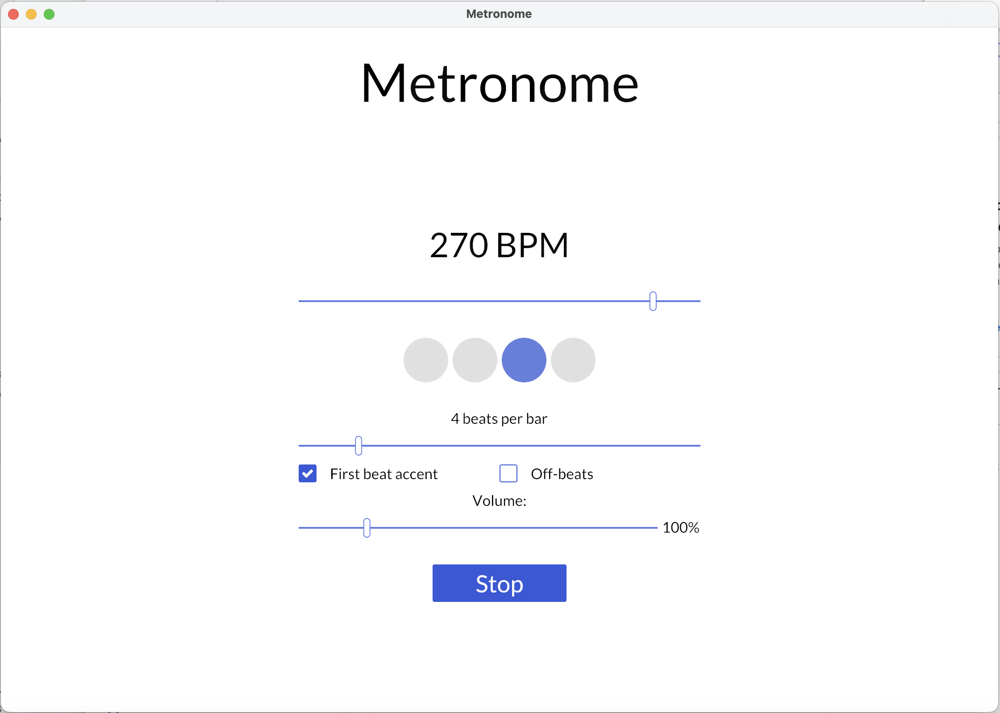

# Metronome

A cross-platform, lightweight (less than 10MB on macOS) and flexible metronome app built with Rust and [Iced](https://github.com/iced-rs/iced).

Metronome has controllable BPM, accented first beats, bar length and volume.

